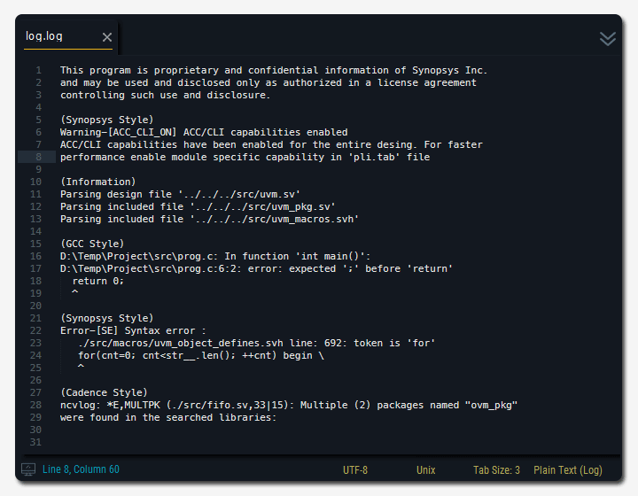
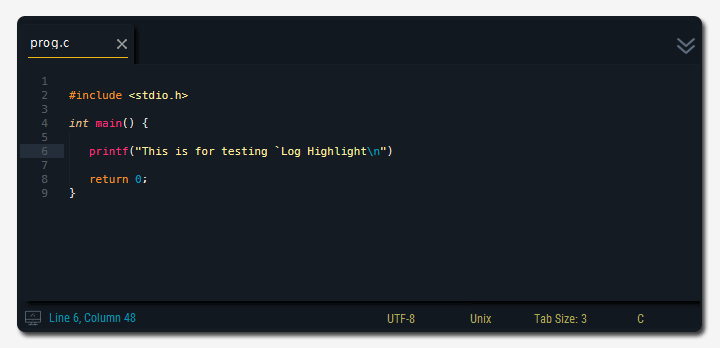

# Log Highlight for Sublime Text

[](https://packagecontrol.io/packages/Log%20Highlight)
[](https://github.com/EatBreatheCode/sublime_trimmer/releases)

Log Highlight helps to view a log (any type) with customizable error/warning syntax & color scheme & extensible severity levels.
Open a log file (like .log) and run __*Log Highlight*__ in the context menu or __*Log Highlight : Highlight Error/Warning*__ in the command palette.

(Compile Log - auto-highlight off (summary panel is deprecated))


(Build Window - auto-highlight on)


(System Log - auto-highlight off)


## Features
***********

 * Customizable Syntax & Color Scheme
 * Extensible Severity Levels
 * Separate log types : "compile", "system"
 * Support multiple kinds of logs with different options, severity levels, theme colors
 * Add Bookmarks Automatically for Navigating Errors/Warnings with customizable icons
 * Support Go To Position in a Log by `result_file_regex`
 * Search a Base Directory Automatically for Relative Path Link
 * Auto Refresh for Multiple Logs
 * Continuous Tracking for Multiple Logs
 * Enable Build Window (Output Panel)

#### Customizable Syntax & Color Scheme

After changing syntax and color scheme in __*Log Highlight.sublime-settings*__, run __*Log Highlight: Generate Custom Syntax & Theme*__ command. You may have to restart sublime text once.

#### Extensible Severity Levels

You can add, remove, change severity levels like debug/notice/emergency in __*Log Highlight.sublime-settings*__, run __*Log Highlight: Generate Custom Syntax & Theme*__ command. You may have to restart sublime text once.

#### Separate Log Types

You can set the log type in settings
. "compile" type : link / bookmark can be activated
. "system" type  : color-highlight only (fast)

#### Support multiple kinds of logs

You can set multiple kinds of logs with different log extension.

#### Bookmarks

When errors/warnings found, it will add bookmarks for them for each icon. Bookmark navigation is enabled(restored) from v1.8.0. You can use bookmark keys like __*F2*__.

#### Go To Position

By double-click, you can go to positions of links like `"../../abc.cpp", 32` or `./abc.v line 234` in a log. For relative path, it may automatically search a base directory near the log file

#### More Flexible Style Syntax

You can highlight links and quotes inside "begin regex", "end regex" and "match regex" by using special words `{{{LINK}}}`, `{{{QUOTE}}}`. It can be used for the following gcc style error/warning message : `./src/abc.cpp:40:2 error: unknown escape seque ...`

#### Auto Refresh for Multiple Logs

When the log files are updated, it automatically refreshes the bookmarks, summary output panel. There's some inertial delays for smooth action.

#### Continuous Tracking for Multiple Logs

If there are open files which already log-highlighted when sublime text restart, it will track all again. (ST3 only)

#### Enable Build Window (Output Panel)

Log Highlight can be used for Build Window or Unsaved View. But relative path link won't be used because the absolute path is unknown. In order to use relative path, you should set like the following: `output_view.settings().set('filepath', [PATH])` output_view is the handle of your output panel view.

### Settings

Please, refer to [__Log Highlight.sublime-settings__](https://github.com/EatBreatheCode/sublime_log_highlight/blob/master/Log%20Highlight.sublime-settings), Available Icons : [__Icon List__](https://github.com/EatBreatheCode/sublime_log_highlight/tree/master/icons)

- __Regular Expression Pattern in Settings__

*Usage*   : `[ "begin regex", "end regex" ] or [ "match regex", "" ]`
*Caution* : avoid OR '|' and separate them, it can make an unexpected result.

example)
```java
Error-[SE] Syntax error :
   ./src/macros/uvm_object_defines.svh line: 764: token is 'for'
--> [ "^Error-\\[", "^\\s*[\\n]" ] // Error-[ ~ next empty line (multi-line)

error ../src/foo.cpp:40
--> [ "^(?i)error", "[\\r\\n]" ] // single line

../src/foo.cpp:40 error:
--> [ "^{{{LINK}}}?[^\\r\\n]*?(?i)error", "[\\r\\n]" ] // single line
```

- __Restore Settings__

Use __*Log Highlight: Erase Syntax & Theme*__ in the command palette Or
Just remove __*Packages/User/Log Highlight*__